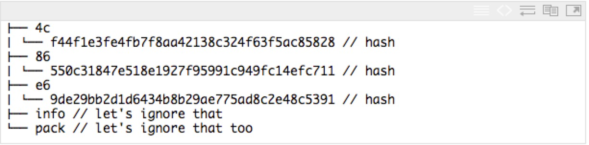
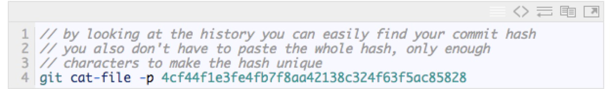
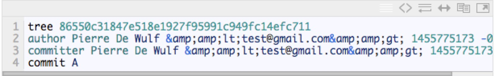
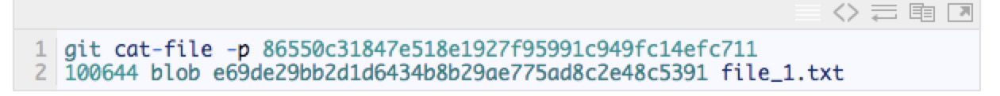
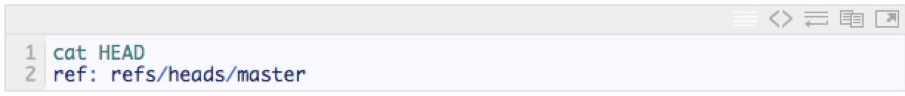
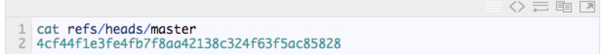
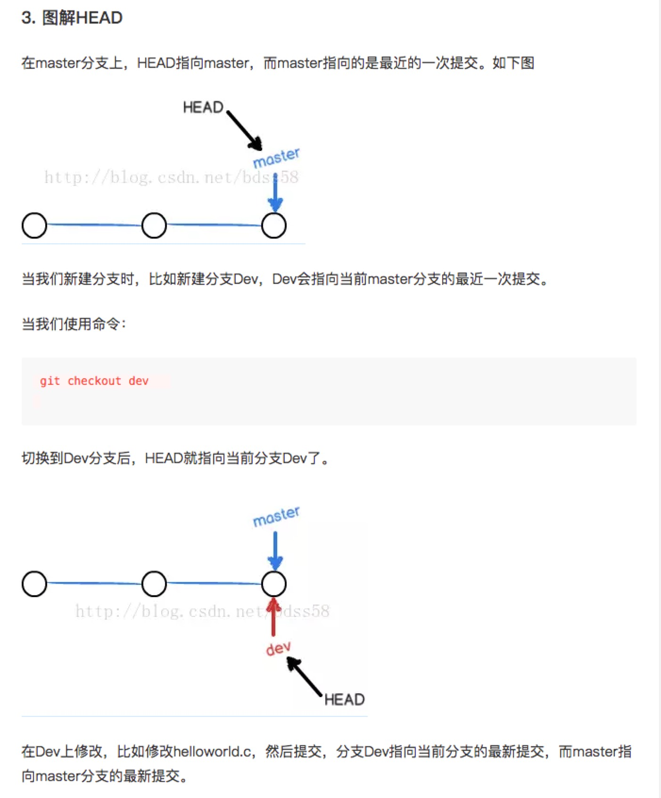
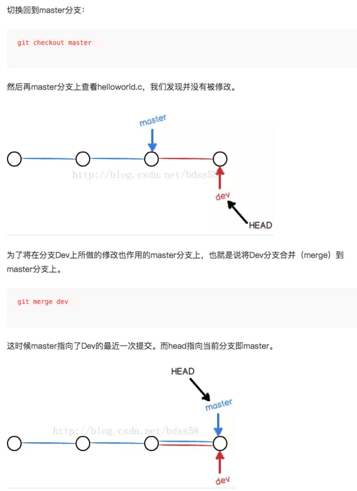
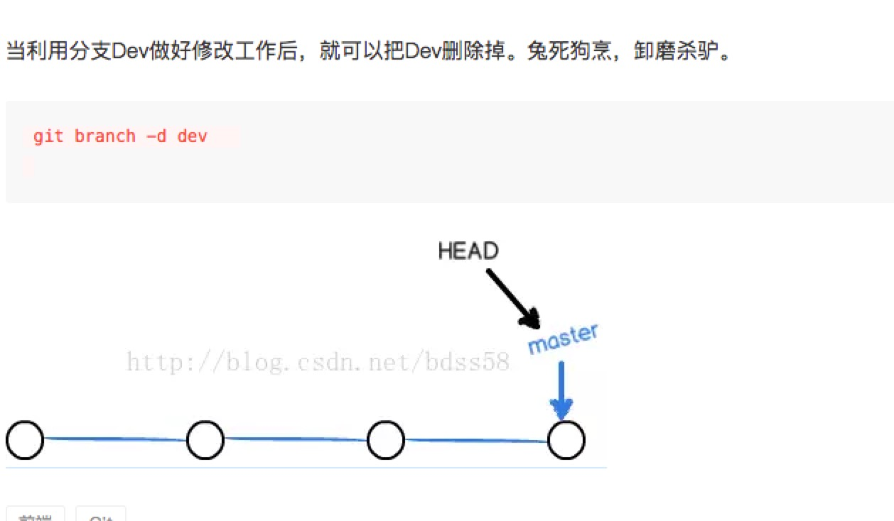

# .git

##  初探 .git

当你创建一个仓库的时候，使用 git init 指令， git 将会创建一个神奇的目录：.git。
这个目录下包含了所有 git 正常工作所需要的信息。说白一点，如果你想从你的项目中删除 git 但是又要保留项目文件，只需要删除 .git 文件夹就可以了。


 1. 这个文件包含你仓库的设置信息。例如这里会放你远程仓库的 URL，你的 email 地址，你的用户名等…。 每次你在控制台使用“git config…”指令时，修改的就是这里。

 2. gitweb(可以说是 github 的前身)用来显示仓库的描述。

 3. 这是一个有意思的特性。Git 提供了一系列的脚本，你可以在 git 每一个有实质意义的阶段让它们自动运行。这些脚本就是 hooks，可以在 commit/rebase/pull…. 的前后运行。脚本的名字表示它什么时候被运行。例如一个有用的预推送 hook 可能会测试关于保持远程仓库一致性的式样原则。

 4. 你可以把你不想让 git 处理的文件放到 .gitignore 文件里。那么，exclude 文件也有同样的作用，不同的地方是它不会被共享，比如当你不想跟踪你的自定义的 IDE 相关的配置文件时，即使通常情况下 .gitignore 就足够了

## commit 的真相

每一次你创建一个文件并跟踪它会发现，git 会对其进行压缩然后以 git 自己的数据结构形式来存储。这个压缩的对象会有一个唯一的名字，即一个哈希值，这个值存放在 object 目录下。


在探索 object 目录前，我们先要问自己 commit 到底是何方神圣。commit 大致可以视为你工作目录的快照，但是它又不仅仅只是一种快照。


实际上，当你提交的时候，为创建你工作目录的快照 git 只做了两件事：

  1. 如果这个文件没有改变，git 仅仅只把压缩文件的名字（就是哈希值）放入快照。
  2. 如果文件发生了变化，git 会压缩它，然后把压缩后的文件存入 object 目录。最后再把压缩文件的名字（哈希值）放入快照。


一旦快照创建好，其本身也会被压缩并且以一个哈希值命名。那么所有的压缩对象都放在哪里呢？答案是object 目录。



我创建一个空文件 file_1.txt 并提交后 object 目录看起来的样子。请注意如果你的文件的哈希值是“89faaee…”，git 会把这个文件存在 “89” 目录下然后命名这个文件为 “faaee…”。


你会看到3个哈希。一个对应 file_1.txt ，另一个对应在提交时所创建的快照。那么第三个是什么呢？其实是因为 commit 本身也是一个对象并且也被压缩存放在 object 目录下。

现在，你需要记住的是一个 commit 包含四个部分：

  1. 工作目录快照的哈希
  2. 提交的说明信息
  3. 提交者的信息
  4. 父提交的哈希值

如果我们解压缩一个提交，你自己可以看看到底是什么：



这是我看到的



如你所见我们得到了所期望看到的的：快照的哈希，作者，提交信息。这里有两样东西很重要：

  1. 正如预料的一样，快照的哈希 “86550…” 也是一个对象并且能在object目录下找到。
  2. 因为这是我的第一个提交，所以没有父提交。

那我的快照里面到底是些什么呢？



到这里我们看到的最后一个对象是我们先前提到的唯一会存在于快照中的对象。它是一个 blob（二进制文件），这里就不作深究了。


## 分支，标签，HEAD 都是一家人

那么现在你知道 git 的每一个对象都有一个正确的哈希值。现在我们来看看 HEAD 吧！那么，在 HEAD 里又有什么呢？



这看起来 HEAD 不是一个hash，倒是容易理解，因为 HEAD 可以看作一个你目前所在分支的指针。如果我们看看 refs/heads/master，就会发现这些：



是不是很熟悉？是的，这和我们第一个提交的哈希完全一样。由此表明分支和标签就是一个提交的指针。明白这一点你就可以删除所有你想删除的分支和标签，而他们指向的提交依然在那里。只是有点难以被访问到。如果你想对这部分了解更多，请参考git book。


## 理解git中的HEAD、head和master

1. 概念

```
说简单一点，HEAD就是当前活跃分支的游标。

形象的记忆就是：你现在在哪儿，HEAD就指向哪儿，所以Git才知道你在那儿！

不过HEAD并非只能指向分支的最顶端（时间节点距今最近的那个），实际上它可以指向任何一个节点，它就是 Git内部用来追踪当前位置的东东。

```

2. HEAD和head

```
你可以认为 HEAD(大写)是"current branch"(当下的分支)。当你用git checkout切换分支的时候，HEAD 修订版本重新指向新的分支。有的时候HEAD会指向一个没有分支名字的修订版本，这种情况叫”detached HEAD“

head(小写)是commit对象的引用，每个head都有一个名字（分支名字或者标签名字等等），但是默认情况下，每个叫master的repository都会有一个head, 一个repository可以包含任意数量的head。在任何时候，只要这个head被选择成为”current head“，那么这个head就成了HEAD,总是大写

```





